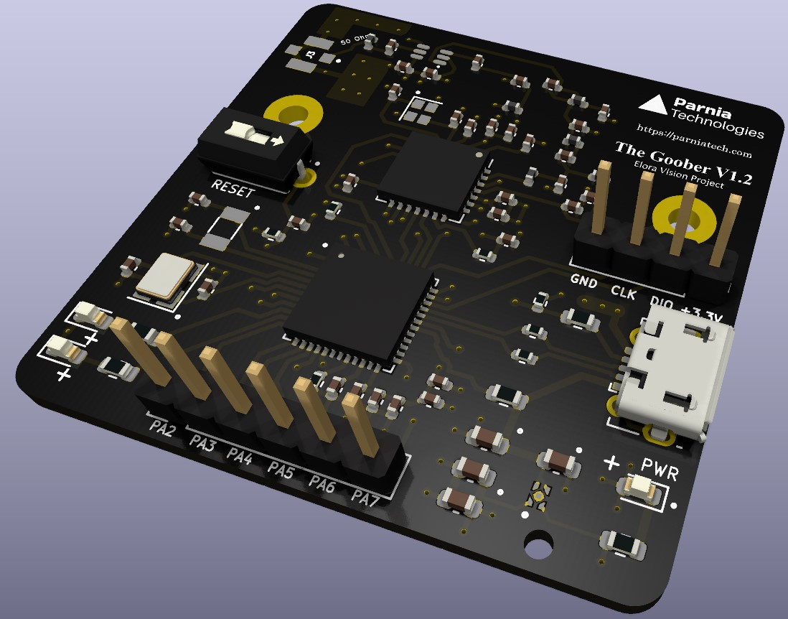

# Elora Vision PCB

KiCad files for image_over_lora project PCB

## Goal
The most important goal for image_over_lora project is to keep the costs low.
So I've made it such that you could simply use already existing boards to set up and work with the porject [just as explained here](https://github.com/aminjahanpour/image_over_lora_android).
For doing that you'd need two boards: a black pill and an a LoRa module.

It could be that a PCB that integerates both of those two modules <b> would cost less</b>.

That is why I've started this project.

## Specs
### General
This is a compact 4-layer PBC powered only via its USB 2.0 connection (Type C plug).
In total, 6 LEDs are included to provide a decent elaboration on both USB and Radio data 
tx/rx processes and possible errors.
A 2-pin SW debug plug is provided for debugging and uploading the firmware.
Also, a USART plug is provided.
To lower the final cost, I used JLCPCB basic parts (rather than extended parts) where I could.
The LCSC part numbers for the parts are included in the BOM.
Use these part numbers to look up the exact components on the JLCPCB website.

### MCU
The board is centered around an STM32F411CEU6 chip.
It provides enough processing power for our Elora Vision firmware.

### LoRa
I chose RX1276 as for the LoRa module because this is perhaps the most common one in North America where I live.
The design targets 915 MHz abiding to the legal frequency bands in Canada.
I went with the IPEX antenna connection because it allows for more flexibility in antenna placement on the UAV.
The radio circuitry is based on the below sources:
- [Semtech reference design](https://www.semtech.com/products/wireless-rf/lora-connect/sx1276)
- [a design by Modtronix](https://modtronix.com/product/inair9b/)

[Also check out my question on StackExchange](https://electronics.stackexchange.com/questions/670470/circuitry-around-sma-for-a-lora-module-pcb-rx1276) regarding the radio circuitry. The given answer is pretty informative.

### Credits

- [A great guide for implementing USB-C in your KiCad projects](https://github.com/jenschr/USB-C-Connectors)
- I highly recommend taking [Phil's Lab PCB design courses](https://www.phils-lab.net/). It helped me a lot.

